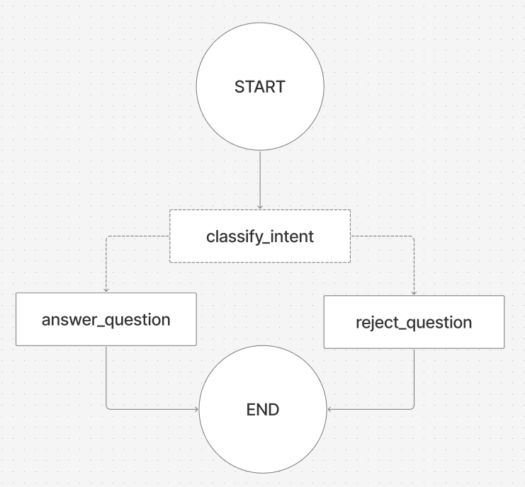

# CLAUDE.md

This file provides guidance to Claude Code (claude.ai/code) when working with code in this repository.

## Project

# ReviewLens AI

ReviewLens AI is a web-based Review Intelligence Portal built for Online Reputation Management analysts.
An analyst ingests customer reviews from a public platform, either by scraping a URL or pasting
review text directly and the application produces a structured summary of what was captured.
From there, the analyst can interrogate the data through a guardrailed chat interface powered by
an AI that answers exclusively from the ingested reviews. Questions outside that scope are explicitly
declined. No hallucinations. No drift. Just the data you loaded.

## Technology Stack

### Frontend
- Vite + React + TypeScript
- Shadcn/ui — component library
- Tailwind CSS v4 — utility styling
- Hosted on Vercel

### Backend
- Node.js + TypeScript
- Vercel Serverless Functions — API routes under /api
- Crawlee — review scraping (Trustpilot primary target)
- LangGraph.js — stateful AI graph with conditional edge guardrails
- OpenAI GPT — LLM powering classification and answer nodes

---

## Frontend Rules

- Use Shadcn components first. Never build a UI element from scratch if Shadcn has it.
- Use a feature-based structure. Each feature gets its own folder under src/features/.
- Feature folder structure: components/, hooks/, types/, and index.ts barrel export.
- Shared UI components go in src/components. Shared hooks in src/hooks. Shared types in src/types.
- Use @/ alias for all imports. Never use relative paths like ../../.
- No inline styles. Tailwind classes only.
- All API calls go through a single src/lib/api.ts client. Never call fetch directly from a component.
- Use TypeScript strictly. No `any`.
- Keep components small. If a component exceeds 150 lines, split it.
- Loading and error states are required for every async operation.

## Backend Rules

- All routes go in api/. One file per endpoint (ingest.ts, chat.ts).
- All LangGraph graph logic stays in api/graph/. Never put graph code inside a route file.
- All system prompts live in api/prompts/. Never hardcode a prompt string inside a node.
- Every route must validate its request body before processing using Zod. Fail fast with a clear error message.
- Define all Zod schemas in api/schemas/. One file per domain (ingest.schema.ts, chat.schema.ts).
- LangGraph state must be typed. Define the state schema in api/graph/state.ts using Zod + LangGraph Annotation.
- Never expose raw errors to the client. Log internally, return a clean message.
- Environment variables only via process.env. Never hardcode keys or secrets.

# Agent Structure

