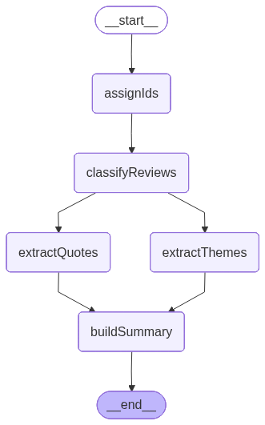
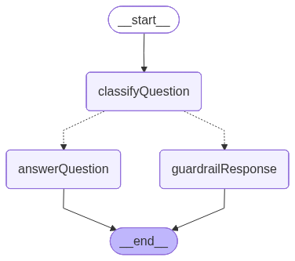

# ReviewLens AI

A review intelligence portal for Online Reputation Management analysts. Ingest App Store reviews, get AI-structured summaries (themes, quotes, sentiment), and interrogate the data through a guardrailed chat interface that answers exclusively from the reviews you loaded.

---

## 1. Prerequisites & Install

| Requirement | Version |
|---|---|
| Node.js | 18 or later (20 LTS recommended) |
| npm | 9 or later |

```bash
# Clone and install
git clone <repo-url>
cd reviewlensai
npm install

# Copy the example env file and fill in your keys
cp .env.example .env
```

Open `.env` and set `OPENAI_API_KEY` (see table below). Everything else has a working default.

---

## 2. Environment Variables

| Variable | Required | Default | What it does |
|---|---|---|---|
| `OPENAI_API_KEY` | **Yes — fill in manually** | *(none)* | Authenticates all LLM calls (classification, quotes, summary, chat). Get one at platform.openai.com. |
| `VITE_API_URL` | Yes | `http://127.0.0.1:3001` | Tells the Vite frontend where the Express API is. Change only if you move the API to a different host or port. |
| `PORT` | No | `3001` | Port the Express server listens on. |
| `NODE_ENV` | No | `development` | Set to `production` in deployed environments to skip dotenv loading. |
| `MAX_SCRAPE_PAGES` | No | `1` | How many iTunes RSS pages to fetch (up to 50 reviews per page). Leave at `1` for demo speed. |
| `LANGSMITH_TRACING` | No | `false` | Enable LangSmith trace logging. |
| `LANGSMITH_ENDPOINT` | No | *(LangSmith default)* | LangSmith API endpoint. |
| `LANGSMITH_API_KEY` | No | *(none)* | LangSmith project API key. |
| `LANGSMITH_PROJECT` | No | `Reviewlens-ai` | LangSmith project name traces are grouped under. |

---

## 3. Run Locally

```bash
npm run dev
```

This single command uses `concurrently` to start both processes side by side:

| Process | Command | URL |
|---|---|---|
| Express API | `npm run dev:api` (nodemon + tsx) | `http://localhost:3001` |
| Vite frontend | `npm run dev:vite` | `http://localhost:5173` |

**How `VITE_API_URL` connects them:** Vite exposes any variable prefixed with `VITE_` to the browser bundle. `src/lib/api.ts` reads `import.meta.env.VITE_API_URL` and prefixes every `fetch` call with it, so the frontend hits `http://127.0.0.1:3001/api/ingest` and `/api/chat` directly — no Vite proxy involved. In a Vercel deployment this value is set to the deployed API function URL instead.

---

## 4. Architecture Diagrams

### Ingest Graph

Triggered by `POST /api/ingest`. Processes up to 15 reviews through a LangGraph pipeline.



`extractThemes` and `extractQuotes` run in **parallel** after classification — they both read from `reviews` and have no dependency on each other. `buildSummary` waits for both via LangGraph fan-in.

---

### Chat Graph

Triggered by `POST /api/chat` (SSE stream). Each question goes through a classify-then-route pattern before any tokens are sent to the client.



---

## 5. Design Decisions

| Decision | Why |
|---|---|
| **iTunes RSS API** | Apple's public review feed requires no API key, no scraping, and has no bot detection — free to call from any environment. |
| **Reviews capped at 15** | Keeps LLM token cost and end-to-end latency low for a demo; the iTunes RSS feed returns up to 50 per page, so pagination can be layered in later without touching the graph. |
| **Themes derived from classifications, not a separate LLM call** | After `classifyReviews` tags each review with a `primaryTheme`, grouping and counting is pure code — a `Map` is faster and cheaper than a second round-trip to the model. |
| **`extractThemes` and `extractQuotes` run in parallel** | They both only read `state.reviews` and have no output dependency on each other, so LangGraph fan-out halves the wall-clock time for that stage. |
| **Guardrail is its own classification node** | Asking the model "is this answerable from the reviews?" in a dedicated step at `temperature: 0` is more reliable than stuffing guardrail instructions into the answer system prompt, where they can be overridden by a persuasive question. |
| **Chat uses SSE streaming** | Tokens are written to the response as they arrive from the OpenAI stream, so the user sees the answer building in real time rather than waiting for the full completion. |
| **`VITE_API_URL` instead of a Vite proxy** | A Vite proxy only works during `vite dev`. Using an explicit env var means the same `src/lib/api.ts` client works unchanged in local dev, Vercel preview deployments, and production. |

---

## 6. Common Pitfalls

**Missing API key — `insufficient_quota` or `401` from the API**
Copy `.env.example` to `.env` and set `OPENAI_API_KEY` to a valid key from platform.openai.com. The model used is `gpt-4.1-mini` — confirm the key has access to that model.

**CORS error in the browser console**
The Express CORS allowlist (`api/server.ts`) accepts `http://localhost:5173` and `*.vercel.app` origins. If Vite binds to a different port (e.g. `5174` after a conflict), update `VITE_API_URL` in `.env` to match and restart both servers with `npm run dev`.

**Port already in use — `EADDRINUSE :3001`**
Another process is holding port 3001. Either kill it with `lsof -ti :3001 | xargs kill`, or set `PORT=3002` in `.env` and update `VITE_API_URL=http://127.0.0.1:3002` to match.
